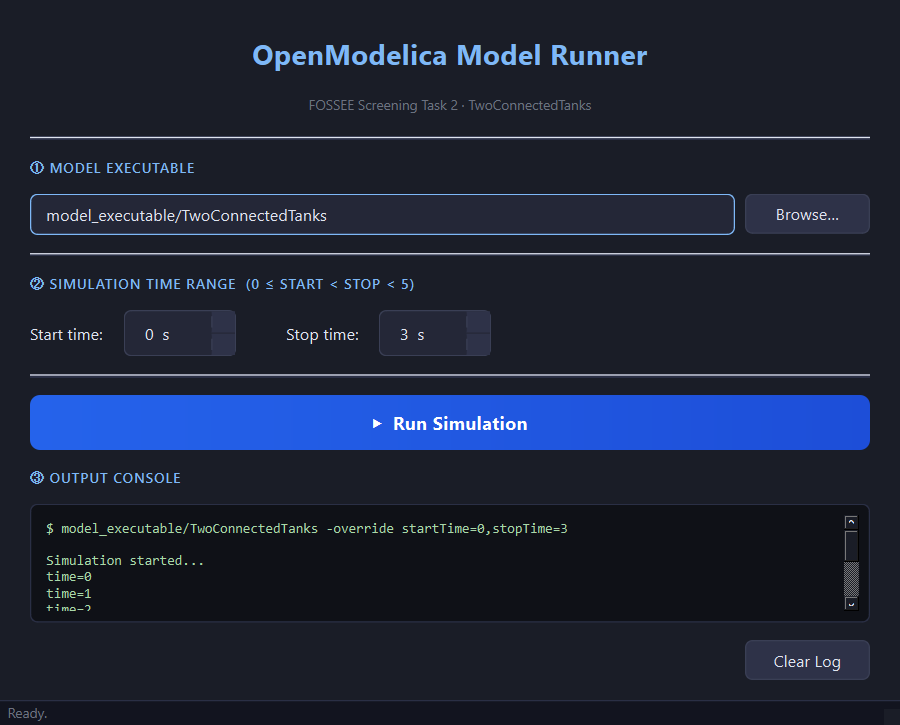

# FOSSEE OpenModelica Model Runner

> **FOSSEE Screening Task 2** — PyQt6 desktop GUI that launches a compiled
> OpenModelica model executable with user-supplied simulation parameters.

---

## Project Overview

This project demonstrates the integration of a compiled
[OpenModelica](https://openmodelica.org/) model — specifically the
**TwoConnectedTanks** example — with a Python desktop GUI built using
[PyQt6](https://pypi.org/project/PyQt6/).

The user selects the compiled model executable, specifies a start and stop
time (integers in `[0, 4]`), and clicks **Run Simulation**.  The application
launches the model binary with the correct OpenModelica `-override` flag,
captures `stdout`/`stderr`, and streams results into a built-in output
console — all without blocking the GUI.

---

## Demo Screenshot



---

## Prerequisites

| Dependency | Minimum version | Purpose |
|-----------|-----------------|---------|
| Python    | 3.10+           | Runtime |
| PyQt6     | 6.4+            | GUI framework |
| OpenModelica (`omc`) | 1.21+ | Required only if **rebuilding** the model |

Install Python dependencies:

```bash
pip install -r requirements.txt
```

---

## How to Run the GUI

```bash
# From the project root:
python -m app.main
```

---

## How the Model Was Built

The `TwoConnectedTanks` model was compiled using the `omc` command-line
compiler — no GUI (OMEdit) required.  The build script is `build.mos`:

```bash
# From the project root (omc must be on your PATH):
omc build.mos
```

This produces `TwoConnectedTanks` (Linux) or `TwoConnectedTanks.exe`
(Windows) and `TwoConnectedTanks_init.xml`.  Move those two files into
`model_executable/`.

> **OS note**: A binary compiled on Linux will not run on Windows and vice
> versa.  If your OS differs from the committer's, please rebuild using the
> `build.mos` script above.

---

## Usage

1. **Select the executable** — click **Browse…** and navigate to
   `model_executable/TwoConnectedTanks` (or `.exe` on Windows).
2. **Set the time range** — use the spin boxes; valid range is
   `0 ≤ start < stop < 5`.
3. **Click Run Simulation** — the button disables while the simulation
   runs; output appears in the console below.
4. On completion, a ✅ / ❌ indicator confirms success or failure.

The equivalent shell command the GUI constructs is:

```bash
./TwoConnectedTanks -override startTime=0,stopTime=3
```

---

## Running the Tests

```bash
pytest tests/ -v
```

No model binary is required — the tests exercise `SimulationRunner.validate()`
and `build_command()` with a temporary dummy file.

---

## Project Structure

```
fossee-om-runner/
├── README.md                   # This file
├── requirements.txt            # PyQt6, pytest
├── build.mos                   # omc build script (Part A)
│
├── model_executable/
│   ├── README.md               # Explains why binaries aren't committed
│   ├── TwoConnectedTanks       # Linux executable (add after building)
│   └── TwoConnectedTanks_init.xml  # Runtime parameter file
│
├── app/
│   ├── __init__.py             # Package marker
│   ├── main.py                 # Entry point — boots QApplication
│   ├── main_window.py          # MainWindow — all UI code, no business logic
│   ├── simulation_runner.py    # SimulationRunner + SimulationResult — Qt-free
│   └── validators.py           # Standalone validation helpers
│
├── tests/
│   ├── __init__.py
│   └── test_simulation_runner.py  # pytest tests for validate() / build_command()
│
└── screenshots/
    └── app.png                 # GUI screenshot for README
```

---

## Known Limitations

- **OS-specific binary**: The committed executable (if any) targets the OS
  on which it was compiled.  Rebuild with `omc build.mos` on your platform.
- **Simulation timeout**: `SimulationRunner` enforces a hard 60-second
  timeout; very long simulations will be terminated.
- **Integer-only times**: The GUI uses `QSpinBox` (integer inputs); the
  OpenModelica runtime does accept floating-point overrides, but that is
  out of scope for this task.
- **No live streaming**: Output appears all at once after the process exits
  (the background thread uses `subprocess.run` + `.communicate()`).

---

## Code Quality

```bash
# Format
black app/ tests/

# Lint
flake8 app/ tests/ --max-line-length=88
```

All source files carry full type hints and docstrings on every public class
and method.

---

## License

MIT © 2025 — FOSSEE Screening Task submission.
